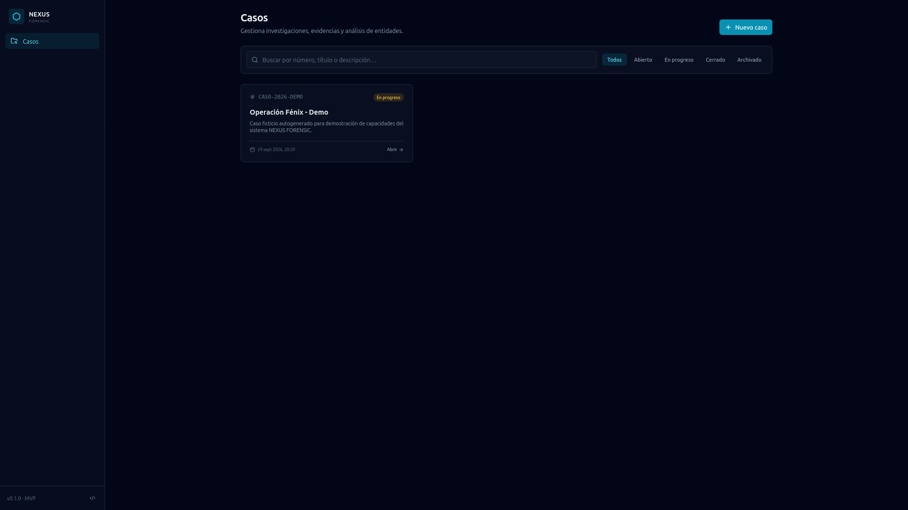
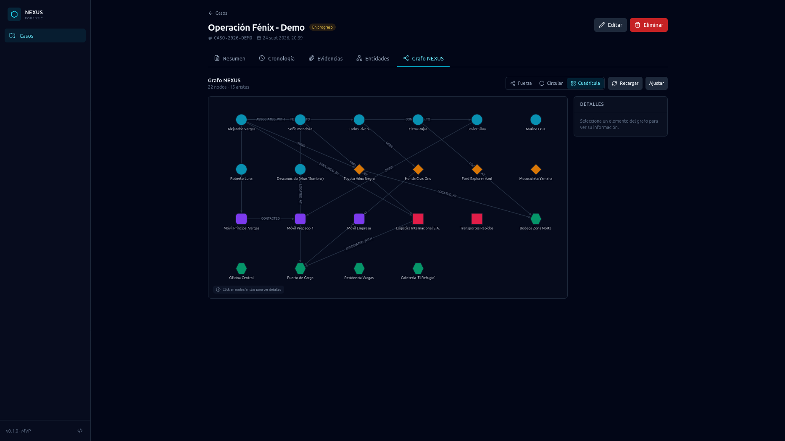
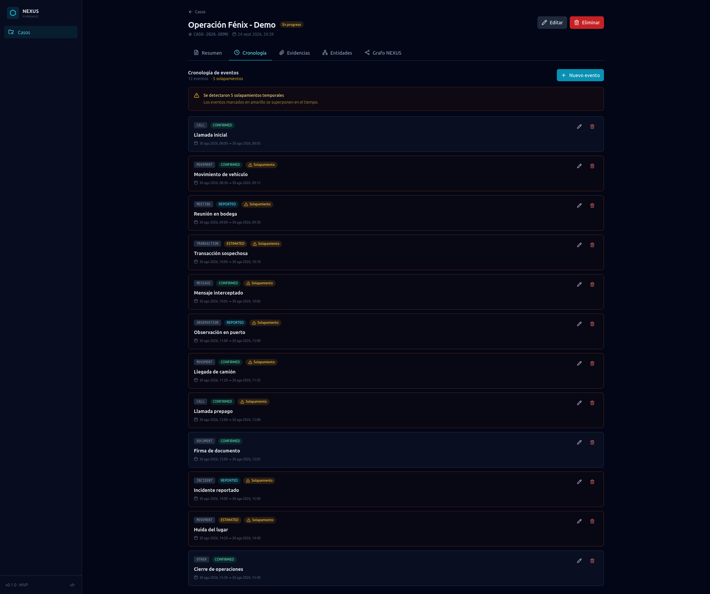
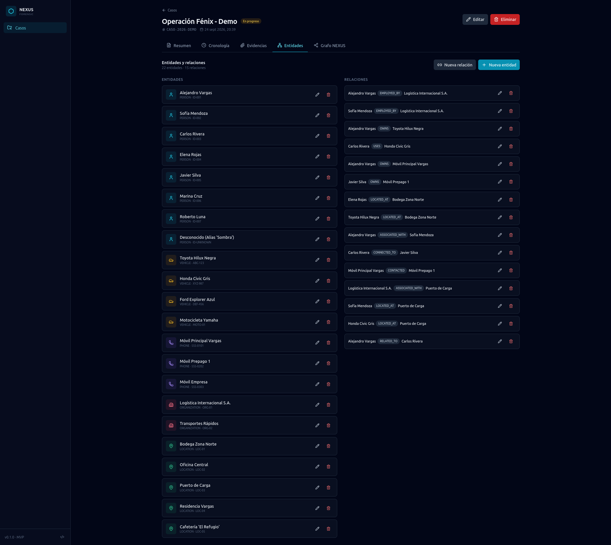
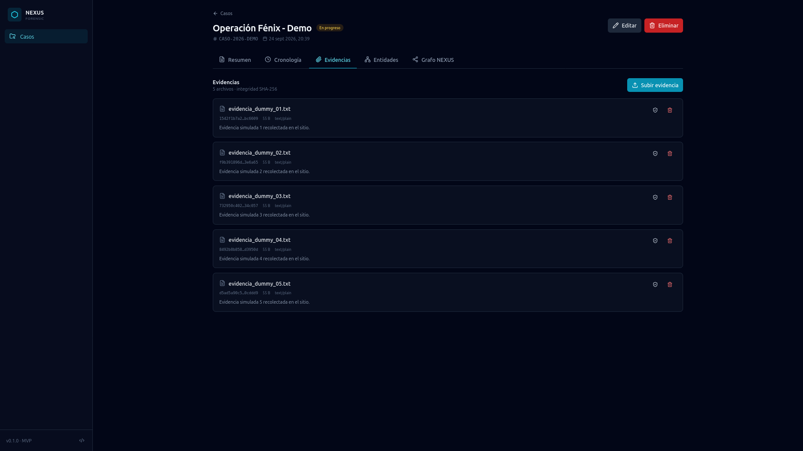

# 🔍 NEXUS FORENSIC

> Plataforma modular para la gestión de investigaciones y el análisis forense digital.

[](https://github.com/Johan-DSP/nexus-forensic/actions/workflows/ci.yml)
[](https://www.python.org/)
[](https://fastapi.tiangolo.com/)
[](https://react.dev/)
[](https://www.sqlalchemy.org/)
[]()
[](./LICENSE)

---

## 📖 Descripción

**NEXUS FORENSIC** es una aplicación full-stack de código abierto diseñada para apoyar investigaciones digitales. Permite:

- 📁 **Gestionar casos** con estado, descripción y metadatos.
- 🕒 **Construir cronologías** de eventos con detección automática de solapamientos temporales.
- 📎 **Subir evidencias digitales** con verificación de integridad mediante hash SHA-256 y registro de auditoría.
- 🕸️ **Analizar redes de entidades** (personas, vehículos, ubicaciones, organizaciones) a través de un grafo interactivo con Cytoscape.js.

El proyecto nace con foco en **arquitectura limpia por capas**, **integridad de datos** y **buenas prácticas de ingeniería**, más allá del típico CRUD.

---

## 🖼️ Capturas

### Dashboard de casos


### Grafo NEXUS interactivo
Visualización de entidades (personas, vehículos, ubicaciones, organizaciones) y sus relaciones. Generado dinámicamente desde `/api/cases/{id}/graph` y renderizado con Cytoscape.js.



### Cronología con detección de solapamientos
Los eventos se ordenan cronológicamente y el sistema resalta automáticamente los que se solapan en el tiempo.



### Gestión de entidades y relaciones


### Evidencias con verificación de integridad SHA-256
Cada archivo subido se hashea al guardarse. El botón de escudo verifica que el hash actual coincida con el almacenado.



---

## 🏗️ Arquitectura

```mermaid
flowchart LR
    subgraph Frontend["Frontend (React 19 + Vite)"]
        UI[UI / Tailwind]
        CYT[Cytoscape.js]
        AXIOS[Axios Client]
    end

    subgraph Backend["Backend (FastAPI)"]
        API[API Layer<br/>routers]
        SCHEMAS[Schemas<br/>Pydantic v2]
        SERVICES[Services<br/>lógica de negocio]
        REPOS[Repositories<br/>acceso a datos]
        MODELS[Models<br/>SQLAlchemy 2.0]
    end

    subgraph Storage["Persistencia"]
        DB[(SQLite)]
        FS[(Storage<br/>evidencias)]
    end

    UI --> AXIOS
    CYT --> AXIOS
    AXIOS -->|HTTP/JSON| API
    API --> SCHEMAS
    API --> SERVICES
    API --> REPOS
    REPOS --> MODELS
    SERVICES --> REPOS
    MODELS --> DB
    SERVICES --> FS
